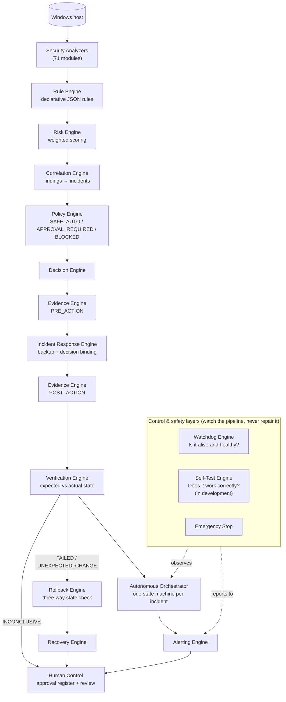
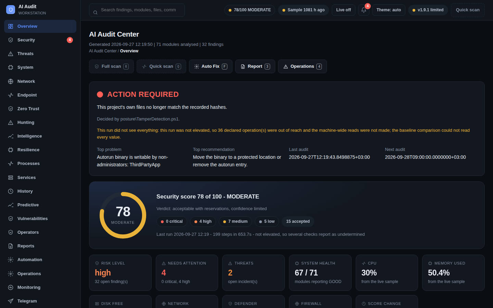
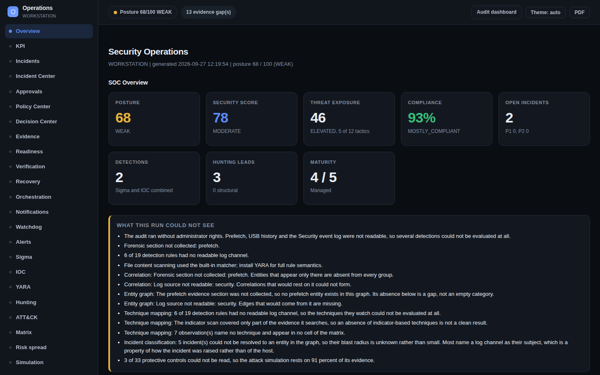
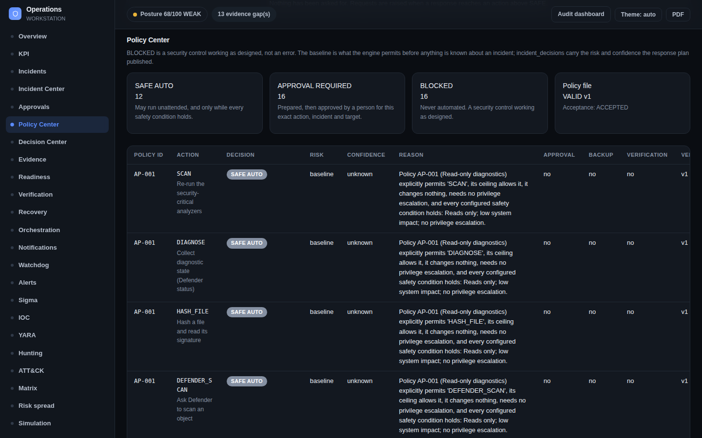
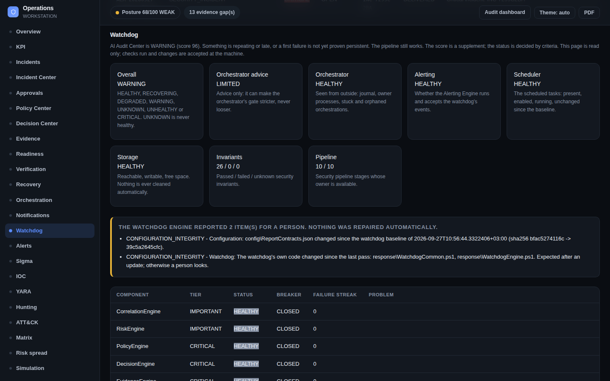
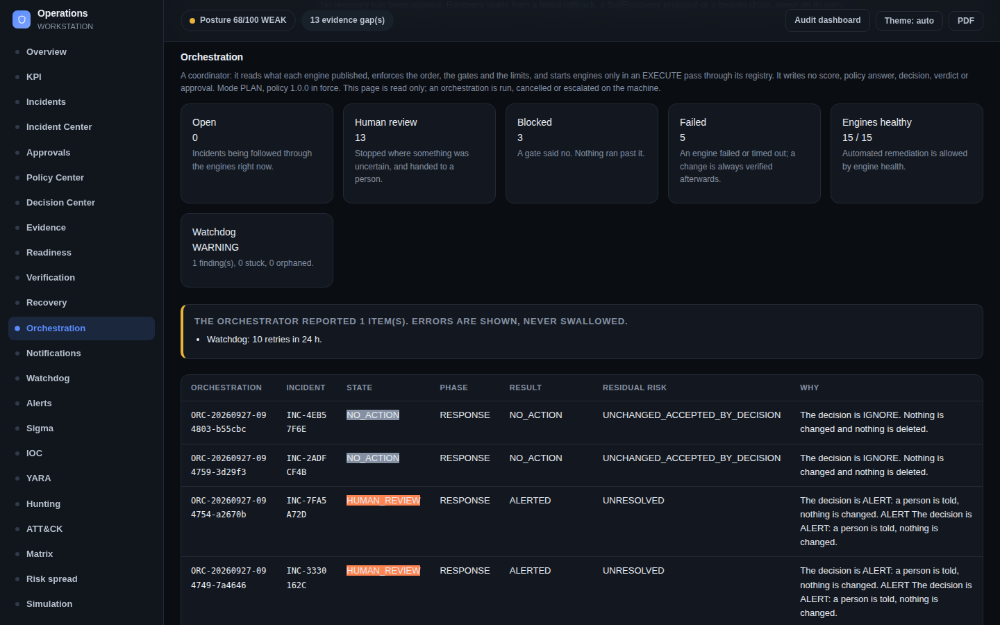
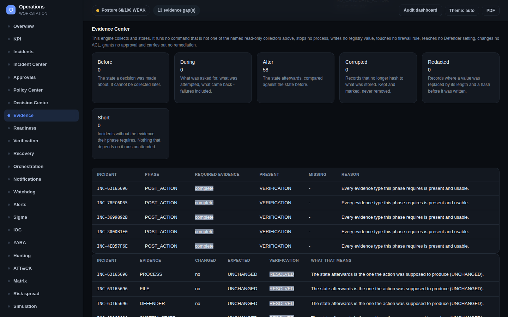
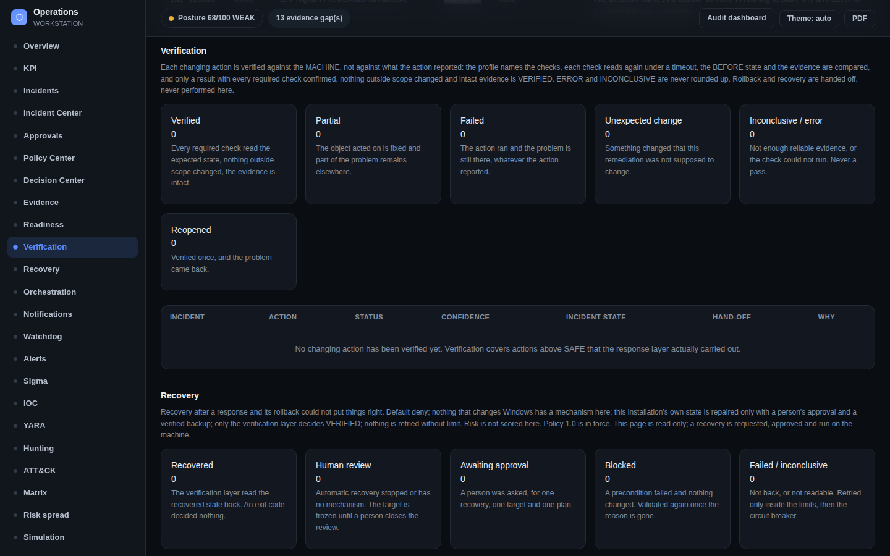
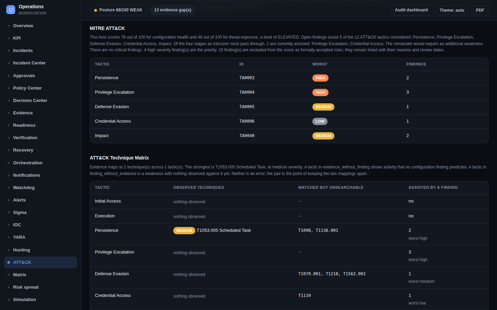
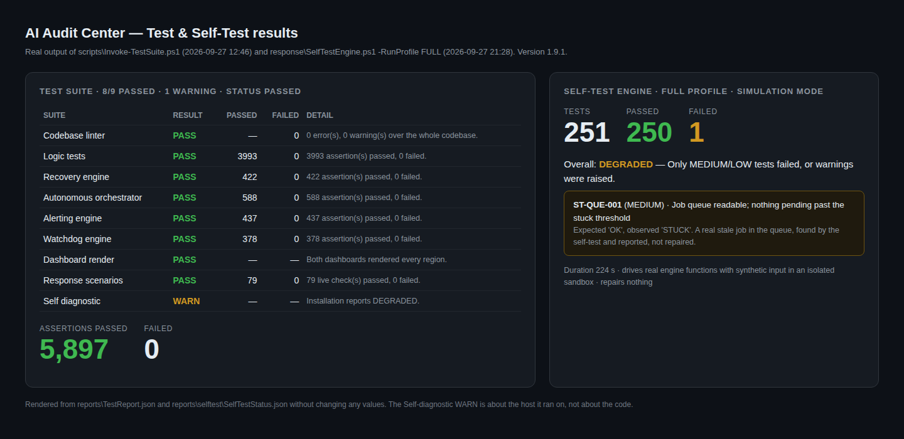

<div align="center">

# AI Audit Center

**A Windows security auditing and security automation platform built with PowerShell.**

It covers detection, risk analysis, evidence, controlled response, verification, rollback, recovery and human-controlled automation.


-lightgrey)

</div>

---

## Overview

> **About this repository.** This is the public showcase of AI Audit Center: the architecture, the safety model, real (redacted) screenshots, verified test results and a real policy file. The source code is kept in a private repository. I'm glad to give employers read access to it on request, via [LinkedIn](https://www.linkedin.com/in/vasyl-mykhayliv-b7bbba415).

AI Audit Center is a personal learning project that I am building and using on my own Windows machine. It audits the security configuration and activity of a Windows host. It scores the risk, correlates findings into incidents and records evidence. On top of that sits a response layer where **every action is authorised by policy, backed up, verified against the real system state, and reversible or escalated to a person**.

> **Scope note.** This is a student project run on a single personal machine. It is not a commercial product, it has not been deployed in an organisation, and it has not been independently audited. The name "AI" refers to the analysis layer. All analysis, scoring and decisions are **deterministic and rule-based**, with no machine-learning model involved.

## Why I Built It

I study computer systems and networks, and I wanted to understand Windows security by building something real instead of only reading about it. Checking Defender, the firewall, services, scheduled tasks, startup entries, event logs and so on by hand is slow and easy to get wrong. I wanted a tool that does this reliably. After that, the harder question became: **how do you let a security tool act on a machine without it becoming a risk itself?** Most of the later work on the project is about that question.

## Problem

- A manual Windows security review touches dozens of subsystems, and the results are hard to compare between runs.
- Single findings are noisy. The real signal is often in how several findings relate to each other.
- Automated remediation is dangerous when it trusts its own "success" message, can't be undone, or can weaken protections.
- A security tool that changes the system has to be auditable: it must record what it saw, what it decided, why, and what happened afterwards.

## Goals

1. Automated, repeatable security auditing of a Windows host.
2. Risk scoring and correlation of findings into incidents.
3. Evidence with integrity hashes and an audit trail.
4. A response pipeline where automation is **limited by policy** and critical actions need **human approval**.
5. Verification of the **actual** system state after any action.
6. Safe rollback and recovery, with no blind restore.
7. Self-monitoring (Watchdog) and self-testing (Self-Test) of the platform itself.

## Architecture



Each pipeline step runs in its own `powershell.exe` process, so a failure in one module can't stop the whole run. Failures are logged in a run manifest.

## Security Automation Pipeline

The project is moving step by step from auditing towards safe automation:

```text
Manual security audit
   → Automated security analysis          (implemented)
   → Controlled security automation       (implemented; real actions gated by policy + approval)
   → Safe autonomous security loop        (planned)
```

The response lifecycle of a single incident:

```text
Detect → Analyze → Correlate → Assess Risk → Policy → Decision → Evidence
       → Response → Verify → Rollback / Recovery → Human Review when required
```

## Features

- **71 analyzer modules** covering identity, malware protection, persistence, network exposure, system integrity and platform configuration.
- **Weighted risk scoring**, trend history and comparison between runs.
- **Correlation** of findings from different sources into incidents.
- **Policy-gated response** with a closed catalogue of action types.
- **Evidence** with integrity hashes, a chain of custody and hash-chained journals.
- **Verification** that reads the real system state instead of trusting the action's own result.
- **Rollback** with a three-way state check, and **Recovery** with human review.
- **Watchdog** health monitoring and a **Self-Test** engine (in development).
- **Reporting**: HTML dashboards (including a SOC view), a security report, and JSON/CSV/Markdown exports.
- **Interfaces**: a local, read-only REST API (OpenAPI spec generated from the route table) and a Telegram bot with read-only commands.
- **Offline by default**: nothing is contacted unless an integration is switched on.

## Security Modules

Statuses below were checked against the source tree and `CHANGELOG.md`.

**IMPLEMENTED** means the code exists, runs in the pipeline and has tests.
**IN DEVELOPMENT** means the code exists but the stage is not closed.
**PLANNED** means no implementation yet.

### Analyzers (selection, 71 in total)

| Module | Purpose | Status |
|---|---|---|
| Defender Analyzer | Microsoft Defender state and protection settings | IMPLEMENTED |
| Defender History Analyzer | Defender detection history | IMPLEMENTED |
| Firewall Analyzer | Firewall profiles and configuration | IMPLEMENTED |
| Network / Open Ports Analyzer | Network exposure and listening ports | IMPLEMENTED |
| Process Analyzer | Running processes | IMPLEMENTED |
| Services Analyzer | Service configuration and risk | IMPLEMENTED |
| Startup / Autoruns / Persistence Analyzers | Startup entries and persistence locations | IMPLEMENTED |
| Scheduled Tasks Analyzer | Scheduled task security analysis | IMPLEMENTED |
| Event Logs Analyzer | Security-relevant event log analysis | IMPLEMENTED |
| Ransomware Analyzer | Ransomware protection posture | IMPLEMENTED |
| Credential Analyzer | Credential protection settings | IMPLEMENTED |
| Drivers Analyzer | Driver analysis | IMPLEMENTED |
| Certificate Trust Analyzer | Trusted root certificate analysis | IMPLEMENTED |
| Remote Access / RDP Analyzers | Remote access exposure | IMPLEMENTED |
| BitLocker, SMB, TLS, PowerShell, USB, WSL … | Further platform checks | IMPLEMENTED |

### Engines

| Engine | Purpose | Status |
|---|---|---|
| Rule Engine | Declarative JSON rules (compliance, detection, Sigma-style, YARA-lite) | IMPLEMENTED |
| Risk Engine | Weighted risk calculation | IMPLEMENTED |
| Correlation Engine | Scores how related findings are, creates incidents | IMPLEMENTED |
| Policy Engine | Authorises action types: SAFE_AUTO / APPROVAL_REQUIRED / BLOCKED | IMPLEMENTED |
| Decision Engine | Decides what should happen about an incident | IMPLEMENTED |
| Evidence Engine | PRE / DURING / POST action evidence with integrity hashes | IMPLEMENTED |
| Incident Response Engine | Binds each action to its authorising decision; backup before change | IMPLEMENTED |
| Verification Engine | Checks the real post-action state | IMPLEMENTED |
| Rollback Engine | Reverses a failed response action after a three-way check | IMPLEMENTED |
| Recovery Engine | Handles failed rollbacks; hands them to a person | IMPLEMENTED |
| Autonomous Orchestrator | One state machine per incident across all engines | IMPLEMENTED (runs in PLAN mode in the pipeline) |
| Alerting Engine | One alert model, queue, deduplication, retry, channel health | IMPLEMENTED |
| Watchdog Engine | Health of the platform itself | IMPLEMENTED |
| Self-Test Engine | Drives real engine functions with synthetic input | IN DEVELOPMENT |
| Human Control Center | Approval register and CLI controls exist; a dedicated interface does not | PARTIAL (see below) |
| Autonomous Security Loop | Continuous detect → respond → verify loop | PLANNED |
| Final Automation Validation | End-to-end validation of the full automated chain | PLANNED |

## Automation Engines

- **Policy Engine** ([`examples/ActionPolicies.json`](examples/ActionPolicies.json)): 8 policies. The file **can only tighten**, because every action type has a ceiling declared in code. An action type that no policy covers is **BLOCKED by default**. If the policy file is invalid or its hash has changed, the engine **fails closed** until a person accepts the change.
- **Decision Engine**: decides what *should* happen about an incident, separately from what *may* happen to the machine.
- **Incident Response Engine**: every action is bound to the decision that authorised it. A backup or restore point is taken before any change. An action above SAFE does not run if the state it would change was never recorded (`EVIDENCE_INSUFFICIENT`).
- **Autonomous Orchestrator**: 27 states with a fixed transition table and a 21-check execution gate. Circuit breakers work per incident, per target and globally, and only a person can reset them, with a stated reason. Crash recovery never resumes blindly. The journal is append-only and hash-chained. `-Execute` runs only after its self-test passes. In the current configuration, `dry_run` is on, so any real action ends BLOCKED. This is intentional.

## Safety Architecture

Security-by-design: the system is built so that the dangerous path does not exist, rather than relying on it never being chosen.

| Class | Meaning | Examples |
|---|---|---|
| **SAFE_AUTO** | Read-only work, or work that changes only the tool's own state. Rate-limited and verified afterwards | scans, diagnostics, hashing, health checks, evidence collection, reports, alerts |
| **APPROVAL_REQUIRED** | Changes Windows. Needs a person, a backup, verification and a rollback path | quarantine, process termination, startup or scheduled-task changes, firewall / registry / service / ACL changes, rollback steps |
| **BLOCKED** | Never automated. Enforced in code, so removing the policy permits nothing | disabling Defender, disabling the firewall, deleting evidence, clearing the audit trail, deleting backups, credential access, privilege escalation, arbitrary commands, creating persistence, security-control bypass, policy bypass, mass file deletion |

Further rules:

- The decision is always the **more restrictive** of the code ceiling and the policy.
- Conditions can only push a decision **towards BLOCKED**, never away from it.
- An **Emergency Stop** (`config/EmergencyStop.json`) blocks automated actions but never silences alerting.
- Policies never contain commands, paths or scripts. They only name action types that are registered in code.

## Human Control

Automation with human control is the core principle of the project.

- Approvals are stored in one **approval register**. Each approval is bound to one action, incident, target and plan hash, and can be used only once.
- **Approval is keyboard-only on the local machine.** I decided on purpose not to add remote "approve" buttons (Telegram or API). This keeps the channel token and the approval register as two independent barriers.
- The orchestrator CLI supports `-Cancel`, `-ForceHumanReview`, `-RequestEvidence` and `-ResetBreaker -Reason "…"`.
- Every uncertain result (INCONCLUSIVE, TIMEOUT, retry limit) goes to **HUMAN_REVIEW**.
- The REST API, the Telegram bot and the SOC dashboard **display** approvals and orchestration state **read-only**. Tests fail if any API route could approve, execute or reset anything.

## Evidence & Audit Trail

```text
Finding → Incident → Decision → Action → Evidence → Verification
```

- Three phases: `PRE_ACTION`, `DURING_ACTION` and `POST_ACTION`.
- An **integrity hash** for each record, computed over redacted content.
- A **chain of custody** for each record, with timestamps and the module that handled it.
- **Append-only** evidence stores and **hash-chained** journals. No function in the evidence library removes a record.
- Secret redaction: sensitive values are replaced by their length and a SHA-256 prefix, never stored.
- `EvidenceEngine.ps1 -Verify` rechecks every stored record and the journal chain.

> This is evidence handling for the tool's own decisions and actions. It is **not** a full digital-forensics platform.

## Verification / Rollback / Recovery

**Action SUCCESS ≠ Security Resolved.** The Verification Engine does not trust the action's own result. It runs read-only probes against the real system state, with a timeout on each probe, and compares **Expected State vs Actual State**:

| Result | Meaning |
|---|---|
| `VERIFIED` | The problem is confirmed gone |
| `PARTIALLY_VERIFIED` | Part of the problem is gone, part remains |
| `FAILED` | The problem is still there |
| `UNEXPECTED_CHANGE` | Something changed that should not have, or a change happened outside the authorised scope |
| `INCONCLUSIVE` | Not enough information to decide. Never rounded up to a pass |
| `ERROR` | The verification itself could not run. **Not a pass** |

A failed read is treated as "not available", never as "absent", so a failed read can't produce a false VERIFIED.

**Rollback** uses a **three-way state check** so that it never restores blindly:

```text
PREVIOUS state (verified restore point)
+ EXPECTED state after the action
+ ACTUAL current state
→ restore only if nothing else has changed the object since
```

```text
Response → Verification FAILED → Rollback (approval) → Verification → Recovery → Human Review
```

- 12 rollback types. 3 have a mechanism, and all 3 need approval. The other 9 are BLOCKED. None is automatic.
- The rollback runs as a transaction: `PREPARE → VALIDATE → AUTHORIZE → EXECUTE → VERIFY`. It stops at the first failed step.
- The rollback engine **cannot mark its own work VERIFIED**. Only the verification layer can.
- **Recovery** repairs nothing on Windows automatically. Any recovery type that would change the system goes to HUMAN_REVIEW with a plan.

## Self-Test

*Status: IN DEVELOPMENT (stage 51).*

The Self-Test Engine calls the **real engine functions with synthetic input**, in an isolated worker runspace and a temporary sandbox, and compares their answers with the expected ones:

```text
TEST → OBSERVE → VERIFY → CLASSIFY → REPORT → ALERT     (it repairs nothing)
```

It covers modules, engines, policies, decisions, evidence, response, verification, rollback, recovery, correlation, risk, alerting, the watchdog, security invariants and failure paths. It also runs the automation chain end to end with synthetic data:

```text
DETECT → CORRELATE → RISK → POLICY → DECISION → EVIDENCE → RESPONSE → VERIFY → …
```

Profiles: `QUICK` (the pipeline step), `STANDARD` and `FULL` (which adds every orchestrator failure path). A real-system-change mode is **refused**: it has no implementation.

## Watchdog

| | Question it answers |
|---|---|
| **Watchdog** | *Is the system alive and healthy?* |
| **Self-Test** | *Does the system actually work correctly?* |

The Watchdog Engine follows one rule: **detect, record, alert, escalate. It never repairs.**

- 87 checks per pass: engines (exists, loads, heartbeat, timeout), the audit run, the orchestrator, scheduled tasks, configuration integrity, state and queues, logging and storage, and its own resources.
- 26 security invariants, read from the journals, the response trail and the approval register.
- A circuit breaker for each component, and false-positive protection (a failure stays TRANSIENT until it repeats).
- It is independent of the orchestrator and judges it from the outside, so a broken orchestrator is reported instead of breaking the Watchdog.

## Technology Stack

| Area | Technology |
|---|---|
| Language | Windows PowerShell 5.1 (no PowerShell 7 required) |
| Platform | Windows 10 / 11, Windows Server 2016+ |
| Data | JSON (rules, policies, reports, contracts), JSONL (append-only ledgers) |
| Integrity | SHA-256 hashing, hash-chained journals, Windows DPAPI for stored secrets |
| Detection content | Sigma-style rules, YARA-lite indicators, IOC feed, MITRE ATT&CK mapping |
| Interfaces | HTML dashboards, local REST API + OpenAPI, Telegram Bot API (optional), SMTP (optional) |
| Testing | PowerShell test suites, Node.js harness for dashboard JavaScript (optional) |
| CI | GitHub Actions on `windows-latest`: syntax, test suite, end-to-end run, release build |

## Project Structure

Layout of the private source repository:

```text
AIAudit/
├── AI-Audit.ps1          # pipeline entry point
├── analyzer/             # 71 analyzer modules (auto-discovered)
├── core/                 # shared libraries (analyzer contract, JSON, logging)
├── response/             # policy, decision, evidence, response, verification,
│                         # rollback, recovery, orchestrator, alerting, watchdog, self-test
├── orchestrator/         # job queue, gates, health, resource guard, self-recovery
├── rules/                # declarative rules and policies (JSON)
├── config/               # configuration (secrets excluded from git)
├── scripts/              # tests, internal audits, release tooling
├── docs/                 # one document per engine + guides
└── .github/workflows/    # CI
```

This showcase repository contains:

```text
ai-audit-center/
├── README.md
├── SECURITY.md
├── docs/images/              # 10 screenshots from a real run (redacted)
└── examples/ActionPolicies.json   # the real action policy file the Policy Engine reads
```

## Current Status

- **Version:** 1.9.1 (`config/Version.json`). Development is organised in numbered stages. Stage 50 (Watchdog) is closed, and stage 51 (Self-Test) is in progress.
- **Runs on:** my own Windows machine. It has not been deployed in any organisation.
- **Automation:** real response actions are gated. In the shipped configuration `dry_run` is on, and every action above SAFE_AUTO needs a person's approval. Outside the test harness, no action above SAFE has been executed on the host.

## Testing

- The project's own test suites, run through `scripts/Invoke-TestSuite.ps1`. They cover logic tests, per-engine suites (orchestrator, recovery, alerting, watchdog, self-test), response scenarios on the live machine with cleanup, and dashboard JavaScript harnesses.
- Latest full run of `Invoke-TestSuite.ps1` (27 Sep 2026, `reports/TestReport.json`): 9 suites, 8 passed and 1 warning (the self-diagnostic reports the installation as DEGRADED, which is about the host, not the code). **5,897 assertions passed, 0 failed**. By suite: logic 3993, orchestrator 588, alerting 437, recovery 422, watchdog 378, and 79 live response-scenario checks. The linter reported 0 errors and 0 warnings.
- Self-Test Engine, FULL profile (27 Sep 2026): **250 of 251** checks passed. The one failure (`ST-QUE-001`) was a real stale job in the queue; the engine reported it and changed nothing.
- In the private repository, a GitHub Actions workflow runs a syntax check, the test suite, a full end-to-end pipeline run and a release build on GitHub-hosted Windows runners.

## Security Principles

1. **Default deny.** Anything not explicitly allowed is BLOCKED.
2. **Fail closed.** An invalid policy, an unknown state or a missing fact all lead to BLOCKED or HUMAN_REVIEW.
3. **Tighten-only configuration.** A config file can never grant more than the code allows.
4. **Verify, don't trust.** The action's own success message is never the verdict.
5. **No blind rollback.** Every rollback goes through the three-way state check.
6. **Append-only records.** Evidence and journals are never edited or removed.
7. **Least privilege.** Read-only by default. Changes need elevation and approval.
8. **Watchers don't repair.** The Watchdog and Self-Test observe and report only.

## Limitations

- Tested on a **single personal machine**. Behaviour in domain or enterprise environments is not validated.
- **No ML/AI model.** The analysis is rule-based and deterministic, despite the project name.
- Real remediation paths above SAFE have been exercised **only in the test harness**, not in daily operation.
- The Self-Test Engine is not finished. The Autonomous Security Loop and Final Automation Validation are not implemented.
- Open item in `docs/ROADMAP.md`: scheduled runs read a different user registry hive, so some HKCU-based checks can report `UNKNOWN` on scheduled runs.
- Test results are produced by the project's own suites. There has been no external security review.

## Roadmap

- [x] 71 analyzers, risk scoring, rule engine, reports and dashboards
- [x] Correlation → Policy → Decision → Evidence → Response
- [x] Verification → Rollback → Recovery
- [x] Autonomous Orchestrator (PLAN mode), Alerting, Watchdog
- [ ] Self-Test Engine (in development)
- [ ] Human Control Center as a dedicated local interface
- [ ] Autonomous Security Loop
- [ ] Final Automation Validation
- [ ] Fix the scheduled-task registry hive issue
- [ ] Test on a second clean Windows installation / VM

## Screenshots / Demo

Real dashboards generated by the pipeline on my machine. Host name, user name, account IDs and third-party app names are redacted.

| | |
|---|---|
|  |  |
| **Audit dashboard**: score, severity breakdown, coverage gaps | **Security operations overview** |
|  |  |
| **Policy Center**: SAFE_AUTO / APPROVAL_REQUIRED / BLOCKED | **Watchdog**: platform health, 26/26 invariants |
|  |  |
| **Orchestrator**: uncertain incidents stop at human review | **Evidence Center**: before/after evidence with integrity |
|  |  |
| **Verification and Recovery** | **MITRE ATT&CK mapping** |



## Author

**Vasyl Mykhayliv**. I study computer systems and networks at a vocational college in Ukraine. I am a junior cybersecurity learner and builder, focused on defensive security and security automation.

- GitHub: [@Vasylmykhayliv848](https://github.com/Vasylmykhayliv848)
- LinkedIn: [vasyl-mykhayliv](https://www.linkedin.com/in/vasyl-mykhayliv-b7bbba415)

The source code is private. The text and images in this showcase repository are © Vasyl Mykhayliv; all rights reserved.
